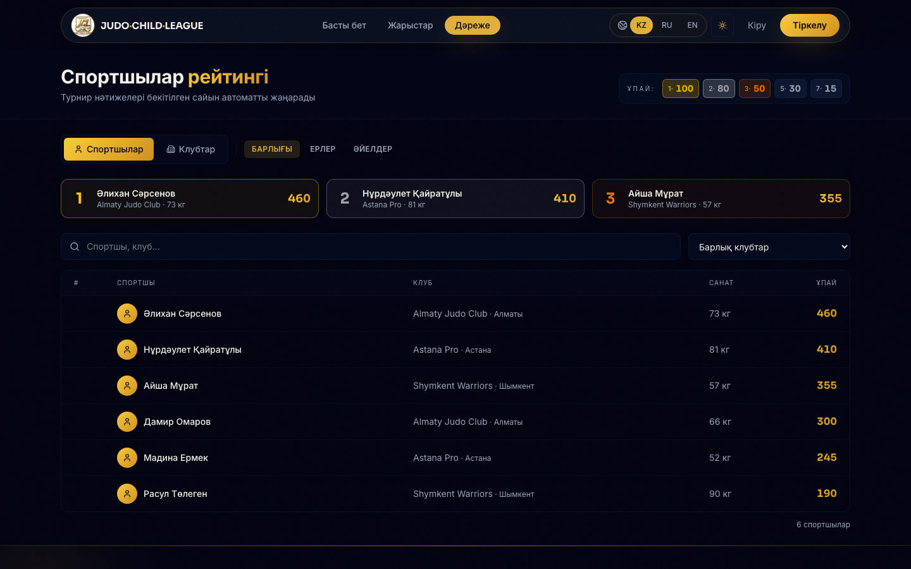
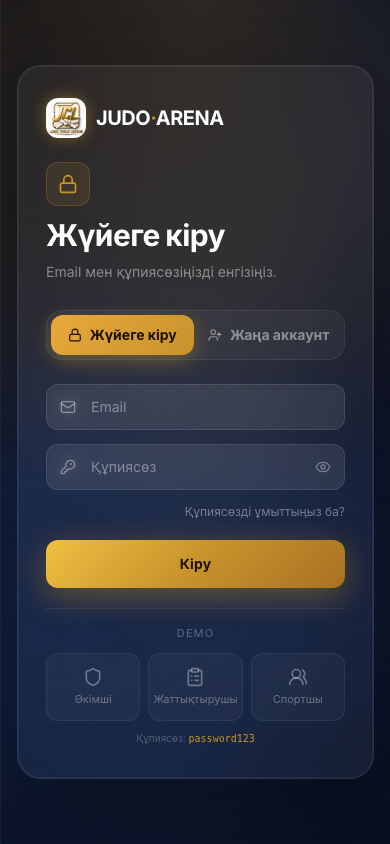

# Judo-Arena

Digital tournament platform for judo competitions: registration, brackets, judging, live results, ratings and PDF protocols in one clean workflow.


## Screenshots

| Home                              | Login                              | Tournaments                              |
| --------------------------------- | ---------------------------------- | ---------------------------------------- |
|  |  |  |

| Rankings                              | Mobile home                              | Mobile login                              |
| ------------------------------------- | ---------------------------------------- | ----------------------------------------- |
|  |  |  |

## Features

- Tournament lifecycle: draft, registration, live event, completed archive
- Bracket engine: single elimination, IJF repechage and round-robin
- Real-time judging: match control, osaekomi timer, score rules and result confirmation
- Role dashboards: admin, coach, athlete and judge/tatami access
- Ratings: athlete and club leaderboards with automatic points
- Protocols: PDF brackets, schedules and final competition reports
- i18n: Kazakh, Russian and English

## Stack

| Layer    | Tech                                                          |
| -------- | ------------------------------------------------------------- |
| Web      | React 19, Vite, TanStack Router, TanStack Query, Tailwind CSS |
| API      | Fastify, TypeScript, Prisma, PostgreSQL, Redis                |
| Realtime | Socket.IO                                                     |
| Tests    | Vitest, Playwright                                            |
| Deploy   | Cloudflare Pages, Render                                      |

## Quick Start

```bash
npm start
```

This starts local services, installs dependencies, applies migrations and runs the API plus frontend.

```bash
npm run start:seed
```

Adds demo data for local testing.

## Demo Accounts

| Role    | Email                            | Password      |
| ------- | -------------------------------- | ------------- |
| Admin   | `admin@judo-arena.kz`            | `password123` |
| Coach   | `coach.almaty@judo-arena.kz`     | `password123` |
| Athlete | `m0-0@almaty-judo.judo-arena.kz` | `password123` |

## Project

```text
judo-arena/
├── api/                 Fastify backend, Prisma schema, services and tests
├── web/                 React frontend and route-based dashboards
├── docs/screenshots/    README visuals
├── e2e/                 Playwright smoke tests
└── .github/workflows/   CI and deploy pipelines
```
