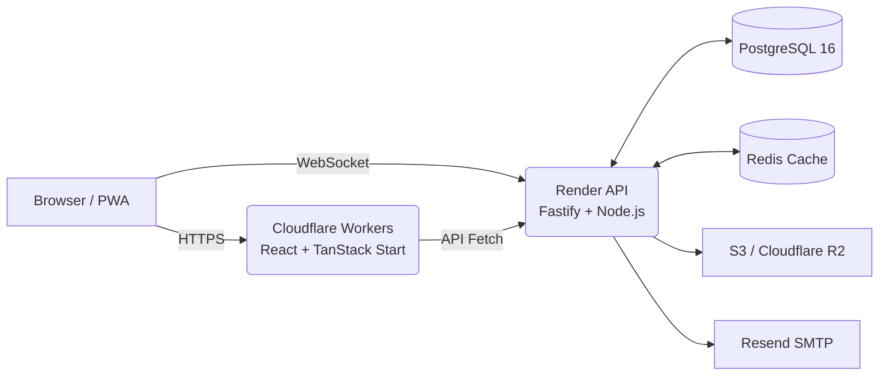

<div align="center">
  
  <h1>🥋 Judo Child League (Judo Arena)</h1>
  <p><strong>Production-ready платформа для проведения соревнований по дзюдо нового поколения.</strong></p>

  <p>
    
    
    
    
    
    
  </p>
  <p>
    
    
    
  </p>
</div>

<hr />

Этот документ является **единой технической и операционной базой знаний проекта**. В нём собрана исчерпывающая информация по запуску, архитектуре, ролевой модели, тестированию и production-деплою.

## 📋 Оглавление

- [✨ Возможности](#-возможности)
- [📸 Интерфейс (Screenshots)](#-интерфейс-screenshots)
- [🏗 Архитектура и Стек](#-архитектура-и-стек)
- [📂 Структура проекта](#-структура-проекта)
- [🔐 Роли и доступы](#-роли-и-доступы)
- [🚀 Локальный запуск (Local Development)](#-локальный-запуск-local-development)
- [🛠 Повседневные команды](#-повседневные-команды)
- [🧪 Тестирование (QA & E2E)](#-тестирование-qa--e2e)
- [⚙️ Переменные окружения (.env)](#-переменные-окружения-env)
- [🚢 Деплой (Deployment)](#-деплой-deployment)
- [🚨 Production Checklist](#-production-checklist)
- [💾 Backup и Restore](#-backup-и-restore)
- [🚑 Troubleshooting](#-troubleshooting)

---

## ✨ Возможности

Платформа закрывает **полный жизненный цикл** спортивного турнира:

- **Управление турниром:** Черновик ➔ Регистрация ➔ Проведение ➔ Завершение ➔ Архив.
- **Участники:** Клубы, тренеры, спортсмены. Модуль заявок в клуб и на турнир.
- **Категории:** Гибкая настройка по полу, возрасту, весу и уровню подготовки.
- **Взвешивание:** Контроль допуска спортсменов перед турниром.
- **Генерация сеток:** Поддержка _Single Elimination_, _IJF Repechage_ и _Round-Robin_.
- **Судейство:** Отдельная судейская зона, работающая без постоянного аккаунта (через защищенный `session token`).
- **Real-time матчи:** Очки (Ippon, Waza-ari), наказания (Shido), удержания (Osaekomi), Golden Score. Синхронизация через **Socket.IO**.
- **Live татами:** Экраны для зрителей с очередью матчей и живым обновлением счета.
- **Рейтинги:** Автоматический расчет очков для клубов и спортсменов.
- **Документация:** Генерация красивых PDF-протоколов, сеток и итоговых отчетов.
- **Уведомления:** Email-рассылки, production-логирование (Sentry) и аудит.
- **i18n:** Полная поддержка трех языков (🇰🇿 Казахский, 🇷🇺 Русский, 🇬🇧 Английский).

---

## 📸 Интерфейс (Screenshots)

|                        Главная                        |                   Вход / Регистрация                   |                           Турниры                            |
| :---------------------------------------------------: | :----------------------------------------------------: | :----------------------------------------------------------: |
|  |  |  |

|                         Рейтинги                          |                      Мобильная Главная                       |                        Мобильный Вход                         |
| :-------------------------------------------------------: | :----------------------------------------------------------: | :-----------------------------------------------------------: |
|  |  |  |

---

## 🏗 Архитектура и Стек



### Технологический стек

| Слой               | Технологии                                                                  |
| ------------------ | --------------------------------------------------------------------------- |
| **Frontend**       | React 19, Vite, TanStack Router, TanStack Query, Tailwind CSS, Lucide Icons |
| **Backend**        | Node.js 22, Fastify, TypeScript, Prisma ORM, Zod                            |
| **DB & Cache**     | PostgreSQL 16, Redis (Key-Value)                                            |
| **Realtime**       | Socket.IO                                                                   |
| **Инфраструктура** | Cloudflare Workers, Render, AWS S3 / R2, Sentry, Resend                     |
| **QA / CI**        | Vitest, Playwright E2E, GitHub Actions                                      |

> **Требования к среде:** Рекомендуется использовать Node.js версии, зафиксированной в `.nvmrc` (`nvm use`).

---

## 📂 Структура проекта

Проект представляет собой монорепозиторий на базе NPM Workspaces:

```text
judo-arena/
├── api/                  # Backend: Fastify API, Prisma schema, services, tests
├── web/                  # Frontend: React, Tailwind, маршруты и страницы
├── e2e/                  # E2E-тесты (Playwright: smoke, a11y)
├── packages/             # Общие пакеты (типы, утилиты)
├── scripts/              # Скрипты (Smoke tests, Load tests, Backup, OpenAPI)
├── docs/                 # Документация и скриншоты
├── .github/workflows/    # CI/CD пайплайны GitHub Actions
├── docker-compose.yml    # Инфраструктура для локальной разработки
├── render.yaml           # Конфигурация деплоя бэкенда на Render (Blueprint)
└── README.md             # Этот документ
```

---

## 🔐 Роли и доступы

Система использует строгую ролевую модель безопасности (RBAC):

| Роль           | Права доступа                                                                 |
| -------------- | ----------------------------------------------------------------------------- |
| 👁 **Public**  | Просмотр публичных турниров, рейтингов, сеток матчей без авторизации.         |
| 🥋 **Athlete** | Профиль спортсмена, вступление в клуб, подача заявок, просмотр своих матчей.  |
| 📋 **Coach**   | Создание/управление клубом, управление спортсменами, оплата взносов.          |
| 👑 **Admin**   | Полный контроль над турнирами, сетками, матчами, судьями и платформой.        |
| ⚖️ **Judge**   | Ограниченный доступ к конкретному татами по временному токену (без аккаунта). |
| 📺 **Tatami**  | Экран-табло для отображения live-статуса площадки и текущего матча.           |

> **Критично для Production:**
>
> - Пароли и JWT-секреты должны быть `>= 32` символов.
> - Доступ судей строго по session tokens с ограниченным сроком жизни.
> - Обязательная настройка `CORS_ORIGIN`.

---

## 🚀 Локальный запуск (Local Development)

### Способ 1: Быстрый старт (с демо-данными)

Убедитесь, что запущен **Docker Desktop**, затем выполните:

```bash
nvm use
npm run start:seed
```

_Эта команда поднимет Docker-контейнеры, накатит миграции БД, создаст тестовые данные и запустит API и Web._

### Способ 2: Ручной поэтапный запуск

1. **Запуск инфраструктуры:**

```bash
docker compose up -d
```

Поднимутся: PostgreSQL (`5433`), Redis (`6379`), Mailpit (`1025`, `8025`).

2. **Запуск Backend API:**

```bash
npm run dev:api
```

3. **Запуск Frontend Web:**

```bash
npm run dev:web
```

4. **Работа с базой данных (Prisma Studio):**

```bash
npm run db:studio
```

### Локальные адреса:

- **Web App:** `http://localhost:5173`
- **API Server:** `http://localhost:4000`
- **Prisma Studio:** `http://localhost:5555`
- **Mailpit (Локальная почта):** `http://localhost:8025`

### 🔑 Demo Аккаунты

| Роль        | Email                            | Password      |
| ----------- | -------------------------------- | ------------- |
| **Admin**   | `admin@judo-arena.kz`            | `password123` |
| **Coach**   | `coach.almaty@judo-arena.kz`     | `password123` |
| **Athlete** | `m0-0@almaty-judo.judo-arena.kz` | `password123` |

---

## 🛠 Повседневные команды

| Описание                           | Команда                             |
| ---------------------------------- | ----------------------------------- |
| Обычный запуск                     | `npm start`                         |
| Применить миграции БД              | `npm run db:migrate`                |
| Сгенерировать Prisma Client        | `npm run prisma:generate -w api`    |
| Очистить БД и залить demo-данные   | `npm run db:seed`                   |
| Остановить Docker                  | `docker compose stop`               |
| Удалить данные Docker (Hard reset) | `docker compose down -v`            |
| Проверить API Health               | `curl http://localhost:4000/health` |
| Сгенерировать OpenAPI доки         | `npm run gen:openapi`               |

---

## 🧪 Тестирование (QA & E2E)

Перед каждым коммитом и деплоем обязательно проверяйте код:

```bash
npm run verify:local
```

Команда прогоняет линтеры, Unit/Integration тесты и проверяет сборку (Build).

**Специфичные тесты:**

- **Запуск API тестов:** `npm run test -w @judo-arena/api`
- **E2E Playwright:** `npm run test:e2e` (Для открытия браузера используйте `npm run test:e2e:headed`)

**Нагрузочное тестирование (Load Tests):**

```bash
API_URL=https://api.example.kz LOAD_CONCURRENCY=50 LOAD_DURATION_SEC=120 npm run load:api
WS_URL=https://api.example.kz SOCKET_CLIENTS=100 SOCKET_DURATION_SEC=120 npm run load:socket
```

---

## ⚙️ Переменные окружения (.env)

Локальные конфиги находятся в файле `.env.example`. Скопируйте его: `cp .env.example api/.env`.

### Важные Production переменные (Backend)

- `NODE_ENV=production`
- `DATABASE_URL` / `REDIS_URL` — Строки подключения к БД и кэшу.
- `JWT_ACCESS_SECRET` / `JWT_REFRESH_SECRET` — Надежные секретные ключи.
- `CORS_ORIGIN` / `APP_URL` — Ссылка на production фронтенд.
- `RESEND_API_KEY` — Ключ для отправки email.
- `S3_PRIVATE_BUCKET` / `S3_PUBLIC_URL` — Настройки файлового хранилища.
- `SENTRY_DSN` — Трекинг ошибок на сервере.

### Frontend переменные

- `VITE_API_URL` — Ссылка на публичный API.
- `VITE_WS_URL` — Ссылка на WebSocket.

---

## 🚢 Деплой (Deployment)

Пайплайны настроены через **GitHub Actions**.

1. **Backend (Render):** Деплоится автоматически через Render Blueprint (`render.yaml`). База данных PostgreSQL и Redis создаются там же.
2. **Frontend (Cloudflare Workers):** Деплоится экшеном при пуше в ветку `main`, если CI-проверки пройдены успешно.

> **Внимание:** Деплой в production заблокирован, если тесты в CI упали.

---

## 🚨 Production Checklist

Перед запуском реального турнира обязательно проверьте:

- [ ] CI/CD зеленого цвета на ветке `main`.
- [ ] Переменные `CORS_ORIGIN` и `APP_URL` настроены корректно.
- [ ] Секреты JWT длинные и уникальные.
- [ ] Email-провайдер работает (письма доходят).
- [ ] S3/R2 Bucket настроен, загрузка файлов работает.
- [ ] `/health` API возвращает статус `ok`.
- [ ] Проведен `npm run prod:smoke` без ошибок.
- [ ] Проведен стресс-тест отсоединения сети у судьи (Network Recovery Test).

---

## 💾 Backup и Restore

Бэкапы БД выполняются автоматически через Render Cron Job (`api/Dockerfile.backup`) и сохраняются в `S3_PRIVATE_BUCKET`.

**Создать локальный бэкап вручную:**

```bash
docker compose --profile backup run --rm backup
```

_Файл появится в папке `./backups/`._

**Восстановить из бэкапа:**

```bash
./scripts/restore.sh ./backups/backup_YYYYMMDD_HHMMSS.sql.gz
```

---

## 🚑 Troubleshooting

- **Порт 5433 или 6379 занят:** `lsof -i :5433` / `lsof -i :6379`. Убейте зависший процесс или измените порт в `docker-compose.yml`.
- **API не видит DATABASE_URL:** Убедитесь, что скопировали `.env.example` в `api/.env`.
- **Ошибки CI Deploy:** Проверьте наличие секретов в репозитории GitHub (`RENDER_DEPLOY_HOOK_URL`, `CLOUDFLARE_API_TOKEN` и др.).
- **Статус Health Degraded:** Откройте `http://localhost:4000/health`. Если БД, Redis или S3 отдают ошибку — почините инфраструктуру перед продолжением турнира.

---

<div align="center">
  <sub>Built with ❤️ by the Judo Arena Team</sub>
</div>
